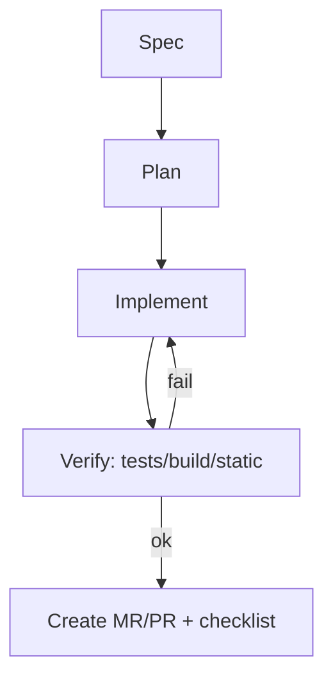

# 4.1. Spec → Plan → Implement → Verify → PR (главная страница процесса)

- **Owner**: DevEx / Engineering Managers (TBD)
- **Статус**: Draft
- **Last reviewed**: 2026-01-15
- **Уровень**: Basic
- **Для ролей**: Dev / TL / QA / SRE / Analyst

## Зачем эта страница

Один общий workflow для IDE‑агента, terminal‑агента и чат‑бота: **результат предсказуем**, изменения контролируемы, риск управляем.

## Ключевой принцип

**Spec (источник истины) → Plan (как делаем) → Implement (патч) → Verify (проверки) → PR/MR (аудит и ревью).**

## Пошагово (процесс)

### 1) Spec — описание результата

Минимум:

- User story / цель
- Acceptance criteria (AC) — проверяемые условия “готово”
- ограничения безопасности (что нельзя трогать/раскрывать)
- границы области изменений (папки/модули)

### 2) Plan — план изменения

План обязан содержать:

- список шагов
- список файлов/модулей
- риски регрессии
- тест‑план (что запускать и какой ожидаемый результат)
- миграционный план (если есть БД/контракты/версионирование)

**STOP‑POINT**: после плана — дождаться “OK”.

### 3) Implement — внесение изменений

Правила:

- маленькими порциями, **минимальный diff**
- каждую порцию можно объяснить (“что изменено и почему”)
- не расширять attack surface без явного обсуждения (auth/crypto/CI/DB)

### 4) Verify — верификация

Минимум:

- тесты (unit/integration/contract — по ситуации)
- линтер/форматтер (если есть)
- сборка/запуск (если применимо)

Если что‑то падает — агент **чинит до зелёного** или фиксирует блокеры явно.

### 5) PR/MR — оформление и ревью

В описании:

- что сделано (ссылка на Spec/AC)
- как проверено (команды/вывод)
- риски и зоны внимания ревьюеру
- план отката (rollback)
- отметка “AI‑assisted” (если принято в компании)

## Mermaid‑шаблон (flowchart)

## Анти‑паттерны

- “Сразу пиши код” без Spec/AC → хаос и споры на ревью.
- “Большой коммит” без STOP‑POINT → высокий риск регрессий.
- “Готово” без Verify → ложные победы.

## Связанные страницы

- [4.2 Definition of Done для AI‑изменений](04_02_Definition_of_Done_AI.md)
- [4.4 Управление контекстом](04_04_Context_Management.md)
- [6.4 Safe prompting & redaction](../06_Security_Compliance/06_04_Safe_Prompting_Redaction.md)

