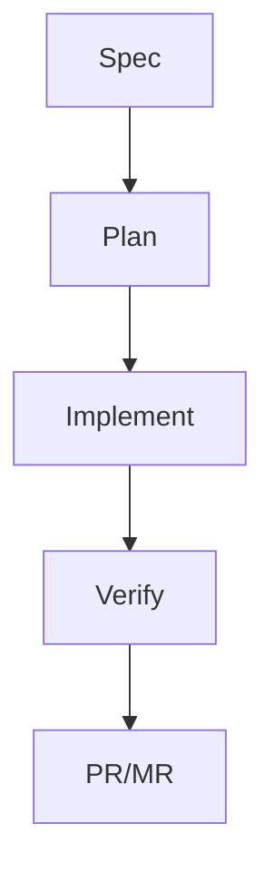
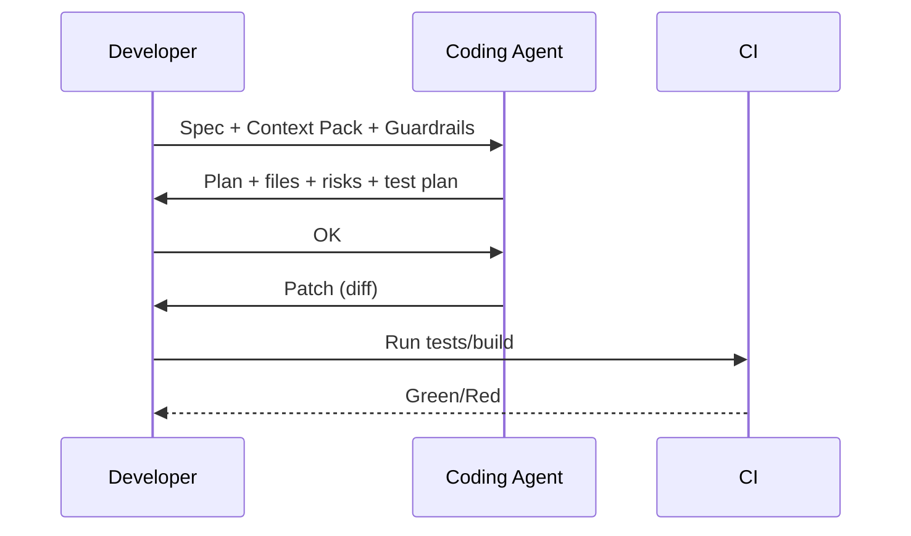

# 10.5. Mermaid‑шпаргалка (C4/sequence/flow/ERD/user journey)

- **Last reviewed**: 2026-01-15
- **Уровень**: Basic

## Flowchart (процесс)

```mermaid
flowchart TD
  A[Spec] --> B[Plan]
  B --> C[Implement]
  C --> D[Verify]
  D --> E[PR/MR]
```

## Sequence (пример)

```mermaid
sequenceDiagram
  participant Dev as Developer
  participant Agent as Coding Agent
  participant CI as CI
  Dev->>Agent: Spec + Context Pack + Guardrails
  Agent->>Dev: Plan + files + risks + test plan
  Dev->>Agent: OK
  Agent->>Dev: Patch (diff)
  Dev->>CI: Run tests/build
  CI-->>Dev: Green/Red
```

